Intro ggplot2
================
Joshua
Mon Apr 24 20:26:05 2017

``` r
library(ggplot2)
library(dplyr)

data(mpg)

glimpse(mpg)
```

    ## Observations: 234
    ## Variables: 11
    ## $ manufacturer <chr> "audi", "audi", "audi", "audi", "audi", "audi", "...
    ## $ model        <chr> "a4", "a4", "a4", "a4", "a4", "a4", "a4", "a4 qua...
    ## $ displ        <dbl> 1.8, 1.8, 2.0, 2.0, 2.8, 2.8, 3.1, 1.8, 1.8, 2.0,...
    ## $ year         <int> 1999, 1999, 2008, 2008, 1999, 1999, 2008, 1999, 1...
    ## $ cyl          <int> 4, 4, 4, 4, 6, 6, 6, 4, 4, 4, 4, 6, 6, 6, 6, 6, 6...
    ## $ trans        <chr> "auto(l5)", "manual(m5)", "manual(m6)", "auto(av)...
    ## $ drv          <chr> "f", "f", "f", "f", "f", "f", "f", "4", "4", "4",...
    ## $ cty          <int> 18, 21, 20, 21, 16, 18, 18, 18, 16, 20, 19, 15, 1...
    ## $ hwy          <int> 29, 29, 31, 30, 26, 26, 27, 26, 25, 28, 27, 25, 2...
    ## $ fl           <chr> "p", "p", "p", "p", "p", "p", "p", "p", "p", "p",...
    ## $ class        <chr> "compact", "compact", "compact", "compact", "comp...

aes signficado el como representar la información en el geom\_LOQUESEA

``` r
ggplot(data = mpg) +
  geom_point(aes(x = hwy, y = displ)) +
  geom_smooth(aes(x = hwy, y = cty))
```

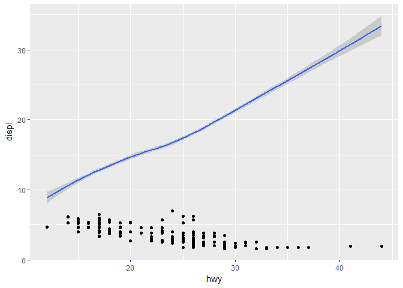

``` r
ggplot(data = mpg) +
  geom_point(aes(x = hwy, y = displ)) +
  geom_point(aes(x = hwy, y = cty))
```

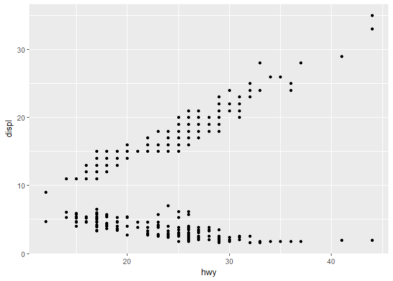

NO!

``` r
p <- ggplot(data = mpg) +
  geom_point(aes(x = hwy, y = displ)) 

q <- p + stat_smooth(aes(x = hwy, y = displ), se = FALSE)
p
```

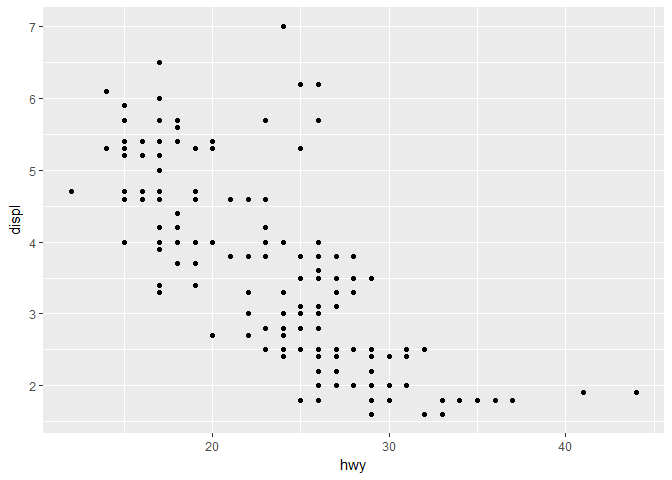

``` r
q
```

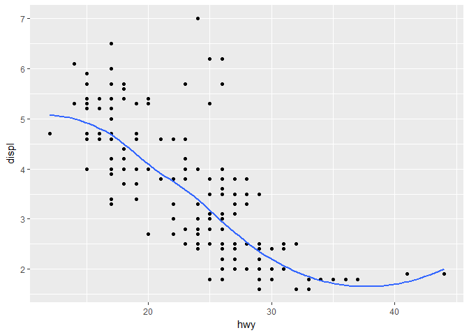

Como incluir otra (fuente) infomacion
=====================================

``` r
mpg_res <- summarise(mpg,
          disp_promedio = mean(displ),
          hwy_promedio = mean(hwy))
mpg_res
```

    ## # A tibble: 1 × 2
    ##   disp_promedio hwy_promedio
    ##           <dbl>        <dbl>
    ## 1      3.471795     23.44017

``` r
ggplot(mpg_res) +
  geom_point(aes(x = hwy_promedio,
                 y = disp_promedio))
```

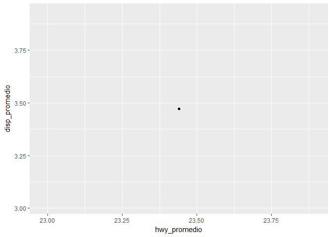

``` r
# muh! bien!

p + geom_point(aes(x = hwy_promedio,
                   y = disp_promedio),
               data = mpg_res,
               color = "red",
               size = 2)
```

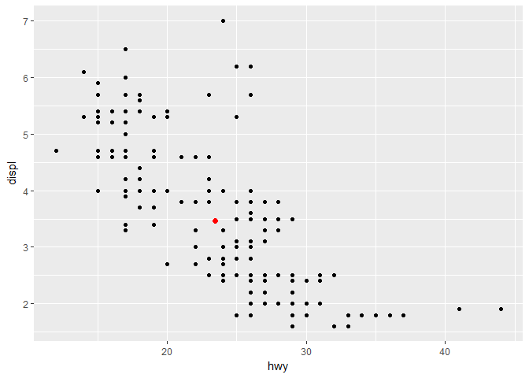

``` r
# mah mejor!
```

Aun mas mejor

``` r
count(mpg, class, sort = TRUE)
```

    ## # A tibble: 7 × 2
    ##        class     n
    ##        <chr> <int>
    ## 1        suv    62
    ## 2    compact    47
    ## 3    midsize    41
    ## 4 subcompact    35
    ## 5     pickup    33
    ## 6    minivan    11
    ## 7    2seater     5

``` r
mpg_res2 <- mpg %>% 
  group_by(class) %>% 
  summarise(
    n = n(),
    disp_promedio = mean(displ),
    hwy_promedio = mean(hwy)
    )
mpg_res2
```

    ## # A tibble: 7 × 4
    ##        class     n disp_promedio hwy_promedio
    ##        <chr> <int>         <dbl>        <dbl>
    ## 1    2seater     5      6.160000     24.80000
    ## 2    compact    47      2.325532     28.29787
    ## 3    midsize    41      2.921951     27.29268
    ## 4    minivan    11      3.390909     22.36364
    ## 5     pickup    33      4.418182     16.87879
    ## 6 subcompact    35      2.660000     28.14286
    ## 7        suv    62      4.456452     18.12903

``` r
p2 <- p + geom_point(aes(x = hwy_promedio,
                   y = disp_promedio,
                   color = class),
               data = mpg_res2,
               size = 5)

p2
```

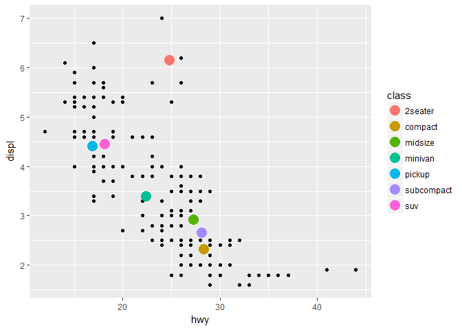

``` r
ggsave(p2, filename = "pedos.pdf")

p2 +
  geom_smooth(aes(hwy, displ, group = drv, color = drv))
```

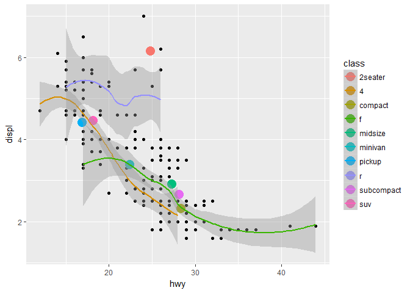

``` r
ggplot(mpg) +
  geom_point(aes(hwy, displ)) + 
  facet_grid(drv ~ trans)
```

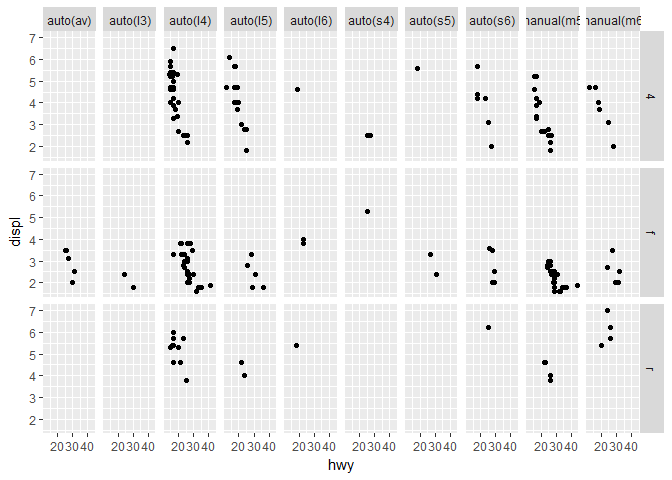

``` r
ggplot(mpg) +
  geom_density2d(aes(hwy, displ)) + 
  facet_grid(drv ~ trans)
```

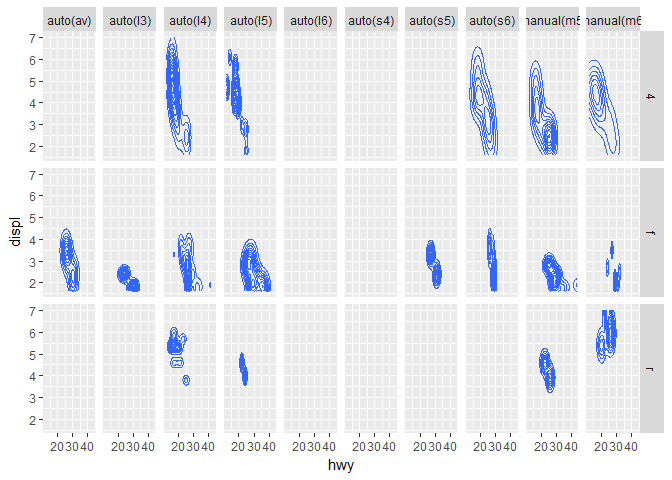

``` r
ggplot(mpg) +
  geom_point(aes(hwy, displ), alpha = 0.5) + 
  geom_density2d(aes(hwy, displ)) + 
  facet_grid(drv ~ trans)
```

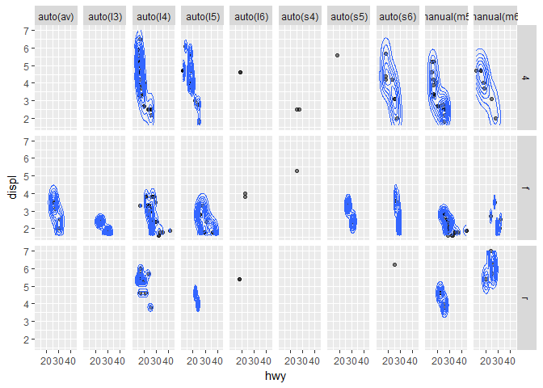

densidad estimada

``` r
ggplot(mpg) +
  geom_point(aes(hwy, displ), alpha = 0.5) + 
  geom_density2d(aes(hwy, displ)) 
```

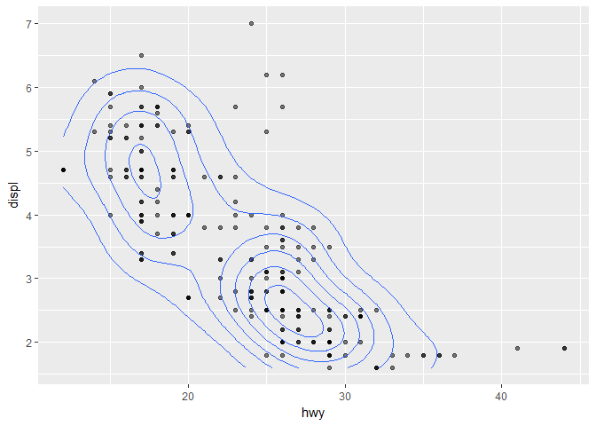

``` r
ggplot(mpg) +
  geom_histogram(aes(cty)) +
  geom_freqpoly(aes(cty))
```

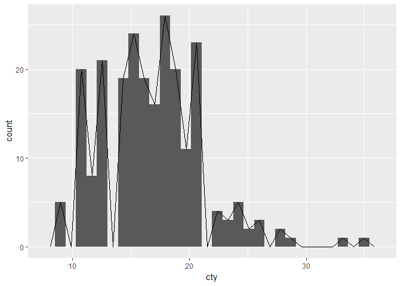

``` r
ggplot(mpg) +
  geom_density(aes(cty))
```

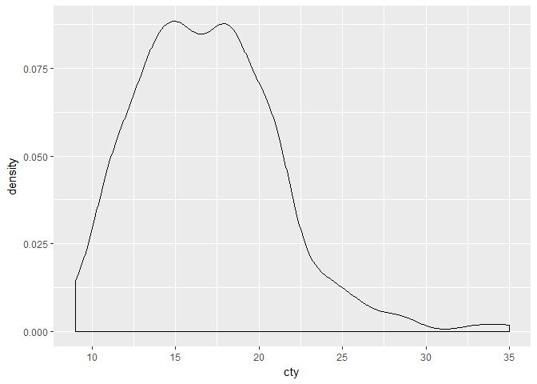

Los parametros fijos van FUERA del aes(),

``` r
ggplot(mpg) +
  geom_density(aes(cty, group = class,
                   fill = drv), alpha = 0.5)
```

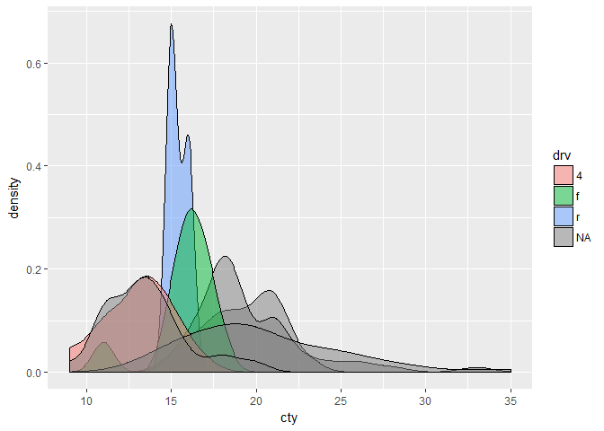

``` r
ggplot(mpg) +
  geom_density(aes(cty, group = class,
                   fill = class), alpha = 0.5) +
  facet_wrap(~ class, ncol = 1)
```

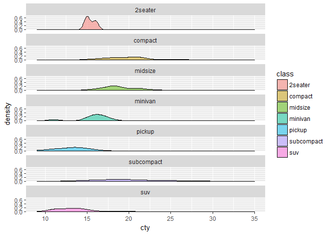

``` r
ggplot(mpg) +
  geom_density(aes(cty, group = class,
                   fill = class), alpha = 0.5) +
  scale_fill_manual(values = rainbow(7)) +
  labs(
    caption = "este un gra",
    title = "asda",
    subtitle = "ASda",
    x = "ASDa"
  )
```

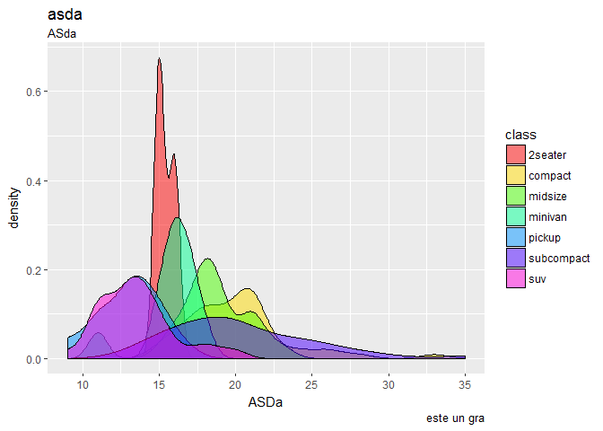
